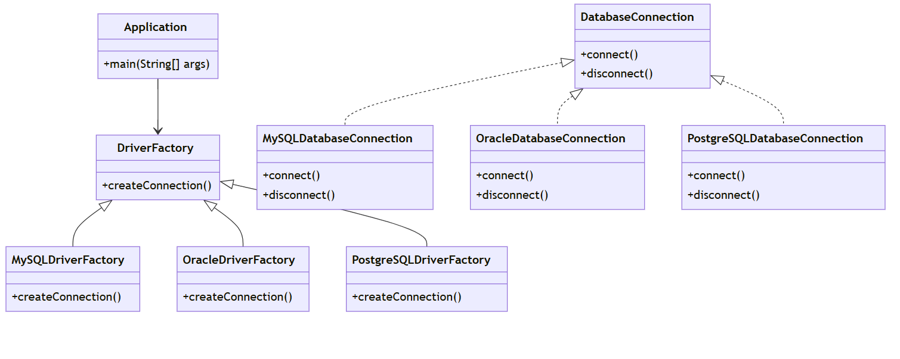

# Database Driver Abstraction

## Опис проєкту
Ця програма демонструє реалізацію підсистеми для роботи з базами даних із використанням шаблону проектування **Abstract Factory**. Вона дозволяє динамічно підключатися до різних баз даних (Oracle, MySQL, PostgreSQL), не залежачи від конкретних драйверів.

## Як працює
1. Користувач вводить тип бази даних через консоль.
2. Програма використовує відповідну фабрику для створення драйвера.
3. Підключення виконується через методи `connect()` і `disconnect()`.

## Як запустити
1. Завантажте код із цього репозиторію.
2. Запустіть файл `Application.java` у середовищі розробки або командному рядку.
3. Введіть потрібний тип бази даних (Oracle, MySQL, PostgreSQL), коли програма запропонує.

## Діаграма класів
Нижче наведено діаграму класів, яка демонструє архітектуру підсистеми:

## Як розширити
- Щоб додати підтримку нової бази даних, створіть нову фабрику та реалізацію інтерфейсу `DatabaseConnection`.
